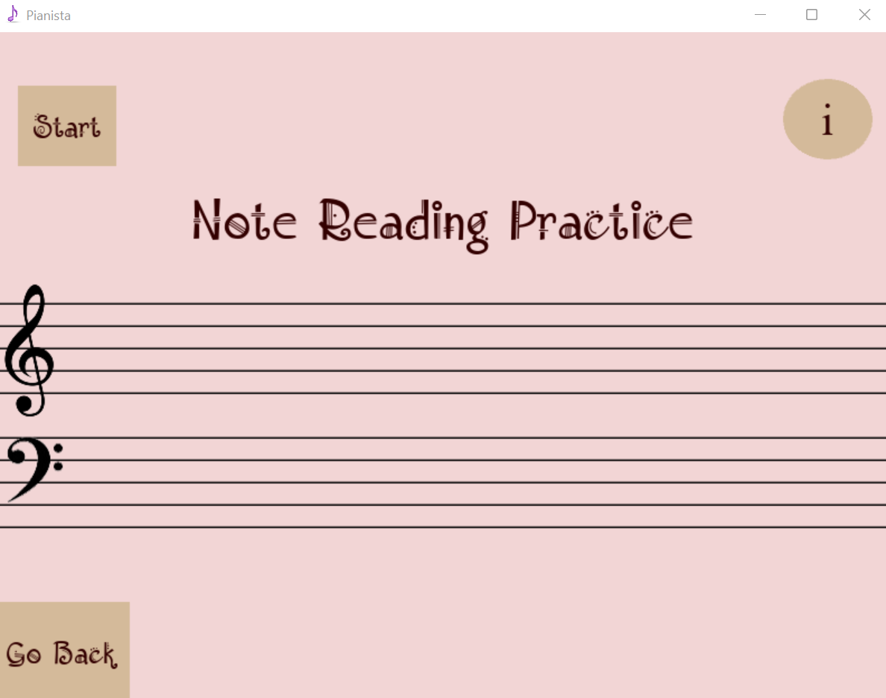

# **Pianista**
Pianista provides innovative tools for learning to play music like note reading practice, hearing development, or rhythm recognition.

* Use json file to random notes.
* Kivy Library for GUI Development
* FFT-...

# Requirement
* python 3.8
* pip install -r requirements.txt
# How To Start Game
* python main.py
# How to Play- Note reading practice
* Start the game by click 'start'.
* Click on the keyboard of the piano that you think appears on the screen.

# How to Play- Absolute Hearing
* Start the game by click 'start'.
* Choose the correct note by clicking on it.
* To hear the note again, press 'Hear Again'.
* For the answer click 'Answer'.

